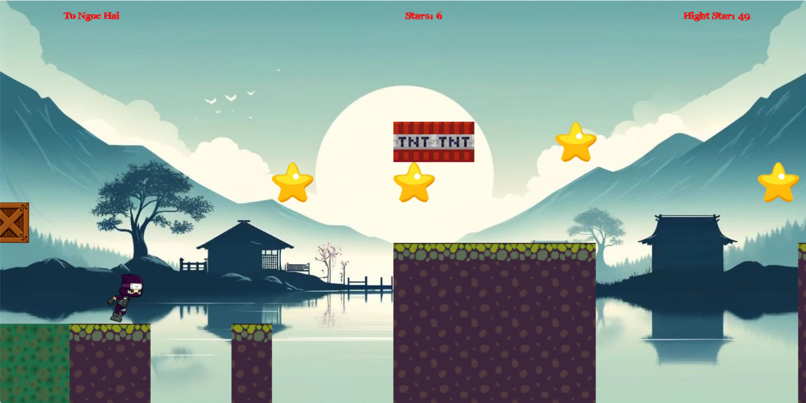

# GAME 'SPEED RUN'
---

---
## Tác giả
> TÔ NGỌC HẢI
> MSSV: 23021543
> Lớp: K68-CA1

## Giới thiệu về game
Một tựa game giống với game *_Dino Chorme_*, nhưng ở đây bạn phải tự mình di chuyển
để kịp với tốc độ của bạn đồ nếu không bạn sẽ bị bỏ rơi. Dùng các mũi tên đẻ di 
chuyển tránh các chướng ngại vật và đem về nhiều ngôi sao nhất cho mình.

## Cách chơi
>1. Mũi tên lên để nhảy
>2. Mũi tên xuống để trượt
>3. Mũi tên sang trái hay sang phải để chạy sang bên trái hoặc phải
>4. Chạm vào cửa sổ màn hình bên trái bạn sẽ thua.
>5. Chạm vào TNT hay POISON bạn sẽ thua.
---
> Bạn sẽ thắng khi chạm vào vương miện
 ## Ngưỡng điểm tự chấm : 8,5
 Lý do:
 1. Game tự viết có thuật toán nằm ngoài chương trình môn học 
 2. Game tự viết có đồ họa đơn giản. 
 3. Game có âm thanh, nhạc nền, texture, ứng dụng trong nhiều phần của game,
logic game hợp lí, các chuyển động và thuật toán tương đối hay.

